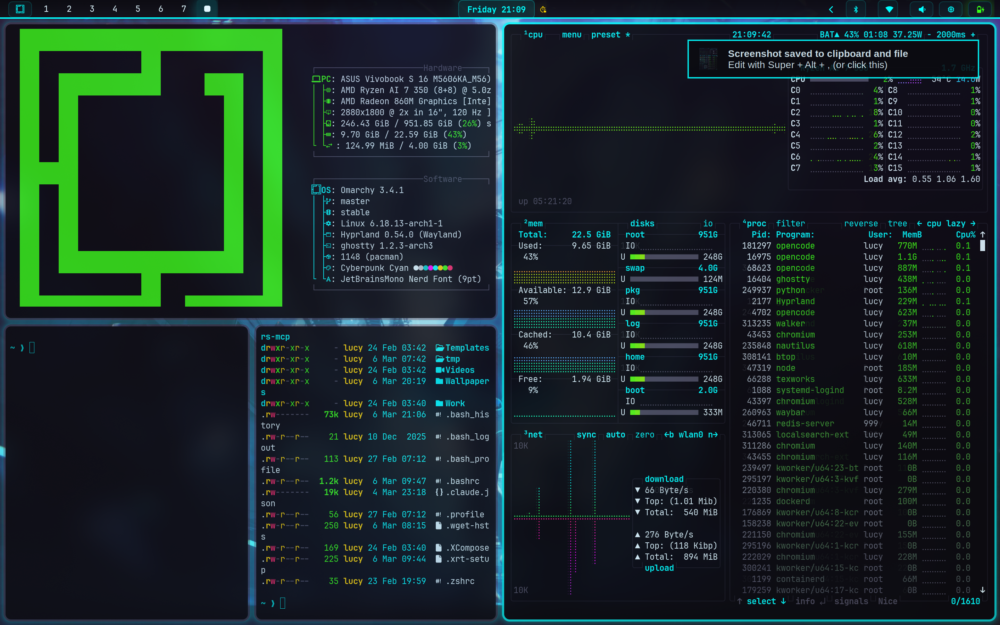

# Cyberpunk Cyan Theme for Omarchy

A cyberpunk-inspired dark theme with vibrant cyan neon accents for [Omarchy Linux](https://omarchy.org).



## Colors

| Color | Hex | Usage |
|-------|-----|-------|
| **Background** | `#0a0a0f` | Main background |
| **Foreground** | `#e0f7ff` | Primary text |
| **Accent (Cyan)** | `#00FFFF` | Borders, highlights, active elements |
| **Cyan Dim** | `#00CCCC` | Secondary accents |
| **Pink** | `#ff2a6d` | Errors, urgent notifications |
| **Green** | `#39ff14` | Success, low urgency |
| **Purple** | `#ff00ff` | Special highlights |
| **Yellow** | `#ffd700` | Warnings, attention |

## Installation

```bash
# Clone the repository
git clone https://github.com/matcraft94/cyberpunk-cyan.git

# Copy to Omarchy themes directory
cp -r cyberpunk-cyan ~/.config/omarchy/themes/

# Apply the theme
omarchy-theme-set cyberpunk-cyan
```

## Recommended Ghostty Settings

For the best cyberpunk experience, add to your `~/.config/ghostty/config`:

```conf
# Font
font-family = "JetBrainsMono Nerd Font"
font-style = Regular
font-size = 9

# Window
window-theme = ghostty
window-padding-x = 14
window-padding-y = 14

# Cursor
cursor-style = "block"
cursor-style-blink = false

# Transparency effect (blur provided by Hyprland compositor)
background-opacity = 0.85

# Performance fix for Hyprland
async-backend = epoll

# Slowdown mouse scrolling
mouse-scroll-multiplier = 0.95
```

**Customization:**
- Opacity: `0.80-0.90` (lower = more transparent)
- Font size: `8-11` (depending on screen size)
- Padding: `10-16` (window spacing)

## Features

- **Transparency & blur effects** - Recommended Ghostty opacity: 0.85 for cyberpunk glass effect
- **Glassmorphism effects** in Walker app launcher with cyan glow
- **Neon glow** on Waybar elements
- **3-level urgency notifications** in Mako (green/cyan/pink)
- **Terminal themes** for Alacritty, Kitty, and Ghostty
- **Obsidian theme** included for note-taking
- **11 unique cyberpunk wallpapers** in various resolutions (1080p to 5K)
- **Hyprlock** screen lock theme
- **SwayOSD** on-screen display styling
- **Optional glitch screensaver** - WebKit2GTK-based cyberpunk glitch effect with the OMARCHY ASCII art, cyan/magenta chromatic aberration, and CRT scanlines (cursor stays visible)

## Cyberpunk Glitch Screensaver (Optional)

An animated glitch screensaver inspired by [Jhey Tompkins' CodePen](https://codepen.io/jh3y/pen/jOOQjYP) is included as an optional add-on. It replaces the default `tte`-based Omarchy screensaver with a lightweight WebKit2GTK window that renders the OMARCHY ASCII art with cyberpunk-style chromatic aberration, scanlines, and random glitch bursts.

**Requirements:**
- `python-gobject` and `webkit2gtk-4.1` installed (standard on most Arch/GTK systems)

**Install:**
```bash
cd ~/.config/omarchy/themes/cyberpunk-cyan/screensaver
./install.sh
```

**Uninstall / Restore original:**
```bash
cd ~/.config/omarchy/themes/cyberpunk-cyan/screensaver
./uninstall.sh
```

**Test it immediately:**
```bash
omarchy-launch-screensaver force
```

> The screensaver closes automatically on any key press or mouse movement, and **does not hide the mouse cursor**.

## Wallpapers

The theme includes 11 unique carefully selected cyberpunk-themed wallpapers:

**Default:** `1369816.png` - Cyberpunk street scene (4K)

| Wallpaper | Resolution | Description |
|-----------|------------|-------------|
| `1369816.png` ⭐ | 4K | **Default** - Cyberpunk street scene |
| `149972.jpg` | HD | Cyberpunk landscape |
| `426401.jpg` | 1080p | Minimal cyberpunk design |
| `693509.png` | 2560x1572 | Neon-lit city street |
| `821174.jpg` | 1920x1080 | Abstract cyberpunk artwork |
| `cyberpunk-2077-5th-3840x2160-24843.jpg` | 3840x2160 | Cyberpunk 2077 5th anniversary |
| `cyberpunk-2077-female-v-2020-games-xbox-series-x-3840x2160-540.jpg` | 3840x2160 | Female V character art |
| `cyberpunk-v-gameplay-3840x2160.jpg` | 3840x2160 | Female V gameplay scene |
| `hatsune-miku-3840x2160.jpg` | 3840x2160 | Hatsune Miku cyberpunk style |
| `hatsune-miku-radiant-5120x3066.jpg` | 5120x3066 | Hatsune Miku radiant 5K |
| `matrix-digital-rain-6500x3520.jpg` | 6500x3520 | Matrix digital rain cyan |

**Note:** Wallpapers are a compilation found from free sources online.

## File Structure

```
cyberpunk-cyan/
├── backgrounds/          # 11 unique wallpapers
├── colors.toml          # Base color palette
├── waybar.css           # Waybar color variables
├── btop.theme           # System monitor theme
├── neovim.lua           # Neovim color configuration
├── vscode.json          # VS Code color customizations
├── icons.theme          # Icon theme reference
├── mako.ini             # Notification daemon theme
├── walker.css           # App launcher styling
├── hyprlock.conf        # Screen lock colors
├── hyprland.conf        # Window manager borders
├── alacritty.toml       # Alacritty terminal colors
├── kitty.conf           # Kitty terminal colors
├── ghostty.conf         # Ghostty complete configuration (colors + settings)
├── swayosd.css          # OSD styling
├── obsidian.css         # Obsidian app theme
├── chromium.theme       # Chromium browser theme
├── keyboard.rgb         # Keyboard RGB colors
├── hyprland-preview-share-picker.css  # Screen share picker
├── screensaver/         # Optional cyberpunk glitch screensaver
│   ├── install.sh
│   ├── uninstall.sh
│   ├── glitch-screensaver.py
│   └── glitch/
│       ├── index.html
│       └── style.css
├── shaders/             # Cyberpunk 2077 screen shader
│   └── cyberpunk2077.frag
└── preview.png          # Theme preview screenshot
```

## Requirements

- [Omarchy Linux](https://omarchy.org) or Hyprland-based system
- Omarchy theme system

## Contributing

Contributions are welcome! Please feel free to submit issues or pull requests.

## License

This project is licensed under the MIT License - see the [LICENSE](LICENSE) file for details.

## Author

**Lucy E. Arias** ([@matcraft94](https://github.com/matcraft94))

Created with love for the Omarchy community.

## Acknowledgments

- [Omarchy](https://omarchy.org) - Beautiful, modern & opinionated Linux by DHH
- [Hyprland](https://hyprland.org) - Dynamic tiling Wayland compositor
- Wallpaper artists from various free sources
